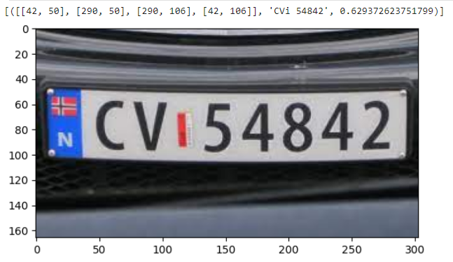
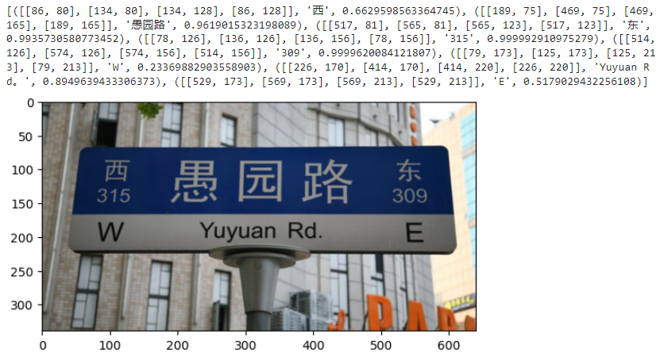
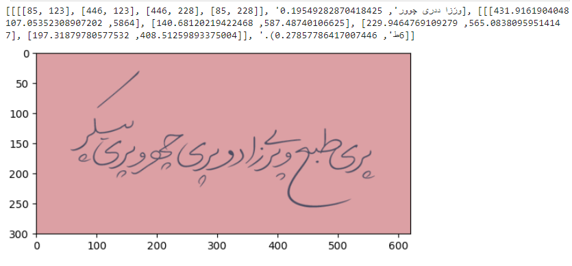
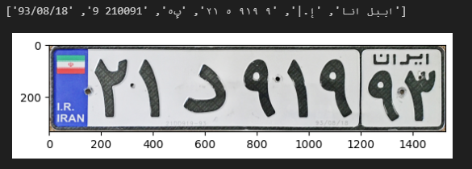
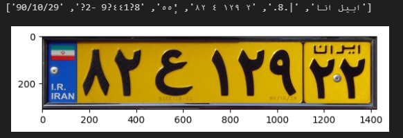

# Iranian License Plate Recognition 

We will compare the performance of OCR and DTRB and see how accurate the results are in correctly identifying Iranian license plates

](assents/image.png)

## How to install

```
pip install -r requirements.txt
```

## OCR

Give the language you are considering to easyOCR and see the results with the Matplotlib library. You can remove the percentage of detection probabilities with a simple Python condition and see those that have a higher percentage of probability.

More complete description and use of [EasyOCR](https://github.com/JaidedAI/EasyOCR)

### results












----

## deep-text-recognition-benchmark


More complete description and use of [deep-text-recognition-benchmark](https://github.com/clovaai/deep-text-recognition-benchmark)


# How to create dataset


Download via [IR-LPR](https://github.com/mut-deep/IR-LPR) repository

# How to train

clone the DTRB repository, We run the demo.py file that was previously taught for a few pictures to make sure of the correctness of our work so far, and we download the file with the pth extension, which is already designed and trained with the architecture, and we use the transfer training method. We use it to teach Iranian license plates that have not been seen on the network.


# How to run

```!python3 train.py \
--train_data dataset/train --valid_data dataset/validation \
--select_data / --batch_ratio 1 --num_iter 10000 --batch_max_length 8 --valInterval 50 \
--Transformation TPS --FeatureExtraction ResNet --SequenceModeling BiLSTM --Prediction Attn 
```

### results

